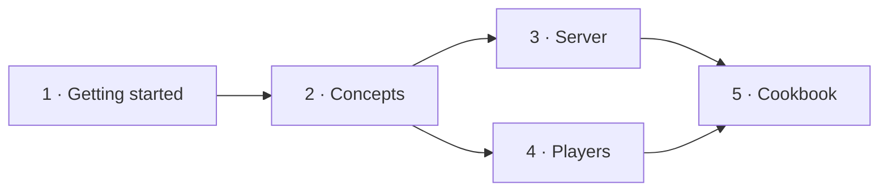

# 🧩 EbonAPI for addon developers

**Plug your Ebonhold addon into the shared runtime.**

EbonAPI 1.0.0 · World of Warcraft 3.3.5a (Interface 30300) · Lua 5.1

EbonAPI is an addon that other addons build on. In one handle it gives you everything an Ebonhold addon keeps rewriting: the link to the server, a channel to the other players, saved data, a shared language, update notices and diagnostics.

These pages are written for developers. Players should read the [addon README](../README.md) instead.

---

## Start here

| Step | Page | You will be able to |
| --- | --- | --- |
| 1 | [Getting started](getting-started.md) | Load EbonAPI, get your handle, react to `READY`. Ten minutes. |
| 2 | [Concepts](concepts.md) | Understand the handle, the lifecycle, events, names and errors. |
| 3 | [Talk to the server](guides/server.md) | Receive run data, Soul Ashes and builds; send requests. |
| 4 | [Talk to other players](guides/channel.md) | Broadcast, whisper, and share datasets that spread on their own. |
| 5 | [Cookbook](cookbook/README.md) | Copy complete, working recipes. |

## Services

Every service hangs off the handle returned by `EbonAPI:NewAddon`. Use only the ones you need.

| Service | Gives you | Guide |
| --- | --- | --- |
| 🚀 Lifecycle and events | `READY`, shared events, sticky values, WoW events, tickers | [Events](guides/events.md) |
| 📝 Logging | Chat output tagged with your addon name, a debug toggle, a trace | [Logging](guides/logging.md) |
| 💾 Storage | Account and character data with defaults and one-shot migrations | [Storage](guides/storage.md) |
| 🌍 Localization | One language for every addon, English fallback, self-refreshing widgets | [Localization](guides/localization.md) |
| 🛰️ Server bridge | Server messages by opcode, parsed run state, throttled requests | [Server](guides/server.md) |
| 🏰 ProjectEbonhold | Feature detection and safe access to the client services | [Ebonhold](guides/ebonhold.md) |
| 📡 Channel | Broadcast to every player who runs your addon | [Channel](guides/channel.md) |
| 💬 Whispers | Direct messages and long streams to one player | [Whispers](guides/whispers.md) |
| 🔄 Sharing | Publish datasets; EbonAPI spreads them between players | [Sharing](guides/sharing.md) |
| 🆕 Versions | Update notices when a newer release is seen | [Versions](guides/versions.md) |
| 🧬 Echo profiles | Class, build slots and ban lists of other players | [Echo profile](guides/echo-profile.md) |
| 📊 Performance | Memory, CPU and running frames per addon | [Performance](guides/performance.md) |

## Reference

| Page | Contents |
| --- | --- |
| [Handle](reference/handle.md) | Every method of the handle, grouped by service |
| [Events catalog](reference/events.md) | Every event, its arguments, and whether it is sticky |
| [Modules](reference/modules.md) | `EbonAPI.State`, `EbonAPI.Ebonhold`, `EbonAPI.Format`, `EbonAPI.Lib`, opcodes |
| [Limits](reference/limits.md) | Every size, count and delay, in one table |
| [Errors](reference/errors.md) | Every error message and how to fix the call |
| [Slash commands](reference/slash-commands.md) | `/eapi` for diagnostics while you develop |
| [Glossary](reference/glossary.md) | The words these pages use, one meaning each |

## Conventions

- `api` always means the handle returned by `EbonAPI:NewAddon`.
- `MyAddon` is the example addon. Replace it with your own name.
- Every code block is complete: paste it and it runs.
- Callouts mark what matters:

> [!NOTE]
> A fact worth knowing before you write the next line.

> [!TIP]
> A shortcut, or 🎮 **Try it**: a `/eapi` command that shows the result in game.

> [!WARNING]
> A trap that will cost you an evening.

---

[Addon README](../README.md) · **Home** · [Getting started →](getting-started.md)
