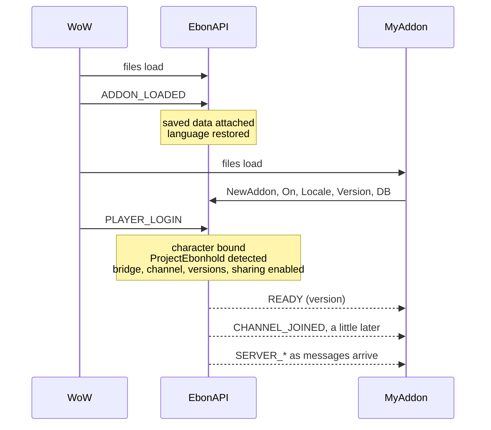

# 🧭 Concepts

The ideas behind every other page: the handle, the lifecycle, events, names, sending, and how errors reach you.

[← Getting started](getting-started.md) · **Concepts** · [Events →](guides/events.md)

---

## The handle

`EbonAPI:NewAddon("MyAddon", 1, 0)` returns a handle. There is one handle per addon name, shared by all your files, and it is the only object you need to keep.

The handle scopes everything by your addon name:

| What | Scoped as |
| --- | --- |
| Chat output | `[MyAddon] ...` |
| Saved data | `EbonAPIDB.addons.MyAddon` |
| Channel messages | `MyAddon:<op>` |
| Share keys and shared data | owner `MyAddon` |
| Translations | the table registered for `MyAddon` |
| Tickers | `MyAddon:<id>` |
| Performance counters | addon `MyAddon` |

Three layers exist. The handle is the one to use.

1. **The handle**, `api:...`: the supported surface, documented in the guides. Everything it registers is tracked, so `api:OffAll()` can undo it.
2. **Global functions**, `EbonAPI:...`: a few calls that belong to no addon, such as `GetVersion`, `SetLanguage` and `AddonNames`.
3. **Modules**, `EbonAPI.State`, `EbonAPI.Ebonhold`, `EbonAPI.Format`, `EbonAPI.Lib`, `EbonAPI.SS`, `EbonAPI.CS`: read-only helpers and parsed data, listed in [Modules](reference/modules.md). The other modules are EbonAPI's internals. Leave them alone: they may change without notice.

## The lifecycle



What this means for your code:

- **At file load**: get the handle, subscribe, register translations and your version, open your saved data. `db.account` is usable; `db.char` is not yet.
- **At `READY`**: the character is known, `db.char` exists, the server bridge listens.
- **At `CHANNEL_JOINED`**: you can broadcast. `api:Say` returns `false` before that.
- **At `PLAYER_ENTERING_WORLD`**: ProjectEbonhold is probed again. Watch `FEATURE_CHANGED` if you depend on one of its services.

Sticky events replay their last value to any subscriber that comes later, so the order in which your files run never matters.

To undo everything at once, when your addon disables itself:

```lua
api:OffAll()
```

This removes every subscription the handle made: EbonAPI events, WoW events, tickers, channel, whisper and server listeners, and your share rule.

## Events

EbonAPI has two event systems. Keep them apart.

### EbonAPI events: `api:On`, `api:Off`, `api:Emit`

Names are `UPPER_SNAKE_CASE` strings. The callback receives the event name first, then up to five values:

```lua
api:On("SERVER_ASH", function(event, ash)
  api:Print(ash.spendable .. " spendable, " .. ash.committed .. " committed")
end)
```

- `api:On` returns `true`, or `false` when that exact function is already subscribed.
- `api:Off(event, fn)` removes one function. `api:Off(event)` removes all of yours for that event.
- An error inside one callback is reported through the game's error handler, and the other callbacks still run.
- `api:Emit(event, ...)` reaches **every** addon, not only yours. Prefix your own events with your addon name in capitals, such as `MYADDON_ROUTE_SAVED`, so they never collide.

**Sticky events** keep their last value. Subscribing to one replays that value immediately, inside the `api:On` call itself, so your callback may run before `api:On` returns. `api:LastValue(event)` reads the value without subscribing.

Sticky: `READY`, `LANGUAGE_CHANGED`, `CHANNEL_JOINED`, `SERVER_RUN_DATA`, `SERVER_INTENSITY`, `SERVER_ASH`, `SERVER_MULTIPLIER`, `SERVER_BUILDS`, `SERVER_BUILD_ACTIVE`, `SERVER_LOADOUT`. Every other event fires and forgets. The full list is in the [Events catalog](reference/events.md).

### WoW events: `api:OnEvent`, `api:OffEvent`

These are the game client's own events, such as `PLAYER_ENTERING_WORLD` or `BAG_UPDATE`. EbonAPI registers them on a shared frame for you. The callback receives the event's arguments **without** the event name:

```lua
api:OnEvent("ZONE_CHANGED_NEW_AREA", function()
  api:Print("Now in " .. GetZoneText())
end)

api:OnEvent("CHAT_MSG_SYSTEM", function(message)
  api:Debug("system: " .. message)
end)
```

### Tickers: `api:Tick`, `api:Untick`

```lua
api:Tick("poll", 5, function(every)
  api:Debug("five seconds passed")
end)

api:Untick("poll")
```

One `OnUpdate` frame serves every ticker of every addon. Ids are yours: `"poll"` in MyAddon and `"poll"` in another addon never clash. Calling `api:Tick` again with the same id replaces the interval and the function.

Guide: [Events](guides/events.md).

## Names

Names are case-sensitive.

| Identifier | Rule | Example |
| --- | --- | --- |
| Addon name, `NewAddon` | 1 to 32 characters, `A-Z a-z 0-9 _` | `MyAddon` |
| Channel op, `OnChannel` and `Say` | letters and digits; keep it short, it travels in every packet | `R`, `ROUTE` |
| Share key name, `Share` and `SetShareKey` | 1 to 32 characters, `A-Z a-z 0-9 _` | `routes_v2` |
| Whisper prefix, `OnWhisper` and `Whisper` | any non-empty string; keep it short and unique to your addon | `MyAddonW` |
| Whisper stream op, `OnWhisperStream` | letters and digits | `SYNC` |
| Ticker id, `Tick` | any string | `poll` |
| Event name, `On` and `Emit` | any string, by convention `UPPER_SNAKE_CASE` | `MYADDON_SAVED` |

## Sending

Every message you send, to the server or to players, goes through one shared queue. It leaves one line every 0.15 seconds, so several addons never flood the client together. Server messages go first; player messages wait behind them. The player queue holds 500 lines.

Send methods tell you what happened with their return value, never with an error:

| Return | Meaning |
| --- | --- |
| `true` | queued; it leaves in order |
| `false` | refused: not joined yet, the queue is full, or the player is known to be offline |

Two events report what happened after queuing: `SEND_FAILED` when the client refused a line, `PEER_OFFLINE` when a whispered player turned out to be offline. Guides: [Channel](guides/channel.md), [Whispers](guides/whispers.md).

## Errors and messages

EbonAPI separates three kinds of messages:

| Kind | How it reaches you | Language |
| --- | --- | --- |
| **Contract error**: wrong type, invalid name, body too long | a Lua `error()` naming the method and what it expected | English, always |
| **Runtime condition**: not joined, queue full, peer offline, version too old | a return value, `false` or `nil`, and an event | none, it is a value |
| **Player message**: update available, EbonAPI too old for an addon, channel slow to join | chat, through the language service | the player's language |

A contract error means a bug in the calling code. It surfaces only where a developer looks: with `/console scriptErrors 1` or an error-display addon. Players with default settings never see it. Fix the call; the message tells you which argument is wrong. The full list is in [Errors](reference/errors.md).

Your own messages to the player go through `api:Print`, `api:Warn` and the translations of `api:Locale`, so they follow the shared language. Your own debug output goes through `api:Debug`, which stays silent until someone enables it with `/eapi debug MyAddon on`.

## Saved data in one place

EbonAPI keeps one saved variable, `EbonAPIDB`, for every addon. Your part of it is reached through `api:DB()`, with an **account** scope and a **character** scope, defaults applied on load, and migrations that run once. You never read `EbonAPIDB` directly. Guide: [Storage](guides/storage.md).

## One language for all

The player picks one language, from any addon's menu or with `/eapi lang`, and every addon follows. An addon without a translation for that language shows English, without changing the language of the others. Guide: [Localization](guides/localization.md).

---

[← Getting started](getting-started.md) · **Concepts** · [Events →](guides/events.md)
