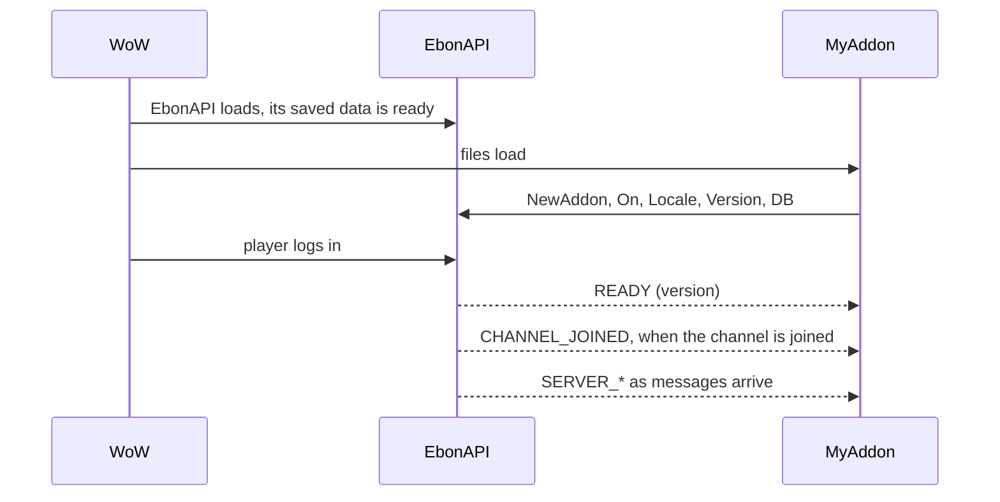

# 🧭 Concepts

The few ideas every other page relies on: the handle, the start-up order, events, names, sending, and how errors reach you.

## The handle

`EbonAPI:NewAddon("MyAddon", 1, 0)` returns a handle. There is one handle per addon name, shared by all your files, and it is the only object you need to keep.

Everything you do through the handle is labelled with your addon name, so two addons never step on each other:

| What | Labelled as |
| --- | --- |
| Chat output | `[MyAddon] ...` |
| Saved data | the data of `MyAddon` |
| Translations | the table registered for `MyAddon` |
| Share keys and shared data | owner `MyAddon` |
| Performance measures | addon `MyAddon` |

EbonAPI offers three ways in. Use the handle; reach for the other two only when a guide tells you to.

1. **The handle**, `api:...`: what the guides describe. EbonAPI remembers every subscription made through it, so `api:OffAll()` can remove them all at once.
2. **Global functions**, `EbonAPI:...`: a few calls that belong to no addon in particular, such as `GetVersion`, `SetLanguage` and `AddonNames`.
3. **Modules**, `EbonAPI.State`, `EbonAPI.Ebonhold`, `EbonAPI.Profile`, `EbonAPI.Format`, `EbonAPI.Lib`, `EbonAPI.SS`, `EbonAPI.CS`: helpers, and data read from the server, listed in [Modules](reference/modules.md). The other tables inside `EbonAPI` are its internals: leave them alone, they may change in any version.

## The lifecycle



What you can do at each step:

- **When your files load**: get the handle, subscribe to events, register your translations and your version, open your saved data. `db.account` is usable; `db.char` is not yet.
- **At `READY`**: the character is known, so `db.char` exists, and the server and player services are on.
- **At `CHANNEL_JOINED`**: you can broadcast to other players. EbonAPI joins the shared channel by itself once an addon is connected; you do not ask for it. Before that, `api:Say` returns `false`. If the channel is lost, `CHANNEL_LOST` fires and `api:Say` returns `false` until `CHANNEL_JOINED` fires again.
- **At every `PLAYER_ENTERING_WORLD`**: EbonAPI checks ProjectEbonhold again. If you rely on one of its services, watch `FEATURE_CHANGED`.

`READY` is sticky, and `CHANNEL_JOINED` is sticky while the channel is joined: a function that subscribes then runs at once with the value. The order in which the game loads your files never makes you miss them.

To undo everything at once, when your addon disables itself:

```lua
api:OffAll()
```

This removes every subscription the handle made: EbonAPI events, WoW events, tickers, channel, whisper and server listeners, and your share rule. Your saved data and your shared data stay.

## Events

EbonAPI handles two kinds of events. Keep them apart: you subscribe to them with different methods, and their callbacks do not receive the same arguments.

### EbonAPI events: `api:On`, `api:Off`, `api:Emit`

Names are `UPPER_SNAKE_CASE` strings. The callback receives the event name first, then up to six values:

```lua
api:On("SERVER_ASH", function(event, ash)
  api:Print(ash.spendable .. " spendable, " .. ash.committed .. " committed")
end)
```

- `api:On` returns `true`, or `false` when that exact function is already subscribed.
- `api:Off(event, fn)` removes one function. `api:Off(event)` removes all of yours for that event.
- An error in one callback is reported through the game's error display, and the other callbacks still run.
- `api:Emit(event, ...)` reaches **every** addon, not only yours, and returns how many functions were called. Prefix your own events with your addon name in capitals, such as `MYADDON_ROUTE_SAVED`, so they never collide.

**Sticky events** keep their last values. Subscribing to one replays them immediately, inside the `api:On` call itself, so your callback may run before `api:On` returns. `api:LastValue(event)` reads the values without subscribing.

Sticky: `READY`, `LANGUAGE_CHANGED`, `CHANNEL_JOINED`, `SERVER_RUN_DATA`, `SERVER_INTENSITY`, `SERVER_ASH`, `SERVER_MULTIPLIER`, `SERVER_BUILDS`, `SERVER_BUILD_ACTIVE`, `SERVER_LOADOUT`. Every other event fires and forgets. The full list is in the [Events catalog](reference/events.md).

### WoW events: `api:OnEvent`, `api:OffEvent`

These are the game client's own events, such as `PLAYER_ENTERING_WORLD` or `BAG_UPDATE`. The callback receives the event's arguments **without** the event name:

```lua
api:OnEvent("ZONE_CHANGED_NEW_AREA", function()
  api:Print("Now in " .. GetZoneText())
end)

api:OnEvent("CHAT_MSG_SYSTEM", function(message)
  api:Debug("system: " .. message)
end)
```

`api:OnEvent` returns `true`, or `false` when that function is already registered for that event. An error in one callback is reported and the other callbacks still run. `api:OffEvent(event, fn)` removes one.

### Tickers: `api:Tick`, `api:Untick`

```lua
api:Tick("poll", 5, function(every)
  api:Debug("five seconds passed")
end)

api:Untick("poll")
```

`api:Tick(id, every, fn)` calls `fn(every)` about every `every` seconds, which must be above 0. Ticker ids belong to your addon: `"poll"` in MyAddon and `"poll"` in another addon are two different tickers. Calling `api:Tick` again with the same id replaces its function and its interval. `api:Untick(id)` returns `true` when it removed a ticker.

Guide: [Events](guides/events.md).

## Names

Names are case-sensitive.

| Name | Rule | Example |
| --- | --- | --- |
| Addon name, `NewAddon` | 1 to 32 characters, `A-Z a-z 0-9 _` | `MyAddon` |
| Channel op, `OnChannel` and `Say` | letters and digits; keep it short | `R`, `ROUTE` |
| Share key name, `Share` and `SetShareKey` | 1 to 32 characters, `A-Z a-z 0-9 _` | `routes_v2` |
| Whisper prefix, `OnWhisper` and `Whisper` | any non-empty text; keep it short and unique to your addon | `MyAddonW` |
| Whisper stream op, `OnWhisperStream` | letters and digits | `SYNC` |
| Ticker id, `Tick` | any text | `poll` |
| Event name, `On` and `Emit` | any text, by convention `UPPER_SNAKE_CASE` | `MYADDON_SAVED` |

An **op** is the short word that says what kind of message you send, so the receiver knows what to do with it. A **prefix** is the label you give your whispers, so the receiver knows they are yours. A **stream** is a long whisper cut into parts and put back together by the receiver. See [Channel](guides/channel.md) and [Whispers](guides/whispers.md).

## Sending

Messages to the server and to players are not sent at once. They wait in one shared queue and leave at a steady pace, one every 0.15 seconds, so several addons never flood the client together. Messages to the server go first. The queue for players holds 500 items. Guides: [Server](guides/server.md), [Channel](guides/channel.md), [Whispers](guides/whispers.md).

The methods that send to players tell you with their return value whether the message was accepted. A refusal is never an error:

| Return | Meaning |
| --- | --- |
| `true` | queued; it leaves in order |
| `false` | refused: the channel is not joined yet (the message is not kept), the queue is full, or the player is known to be offline |

`api:SendServer` always returns `true`. `api:RequestServer` returns `false` when the same request was already sent less than its minimum interval ago.

Two events report what happened after queuing: `SEND_FAILED` when the client refused a message, `PEER_OFFLINE` when a whispered player turned out to be offline.

## Errors and messages

EbonAPI separates three kinds of messages:

| Kind | How it reaches you | Language |
| --- | --- | --- |
| **Contract error**: wrong type, invalid name, body too long | a Lua `error()` whose message says what was expected | English, always |
| **Runtime condition**: not joined, queue full, peer offline | a return value, `false` or `nil`; `SEND_FAILED` and `PEER_OFFLINE` report some of them | none, it is a value |
| **Player message**: update available, EbonAPI too old for an addon, channel slow to join | chat, through the translations | the player's language |

A contract error means a bug in the calling code. The message says which argument is wrong and what was expected; [Errors](reference/errors.md) lists every message and how to fix the call.

An EbonAPI that is too old for your addon is both: `NewAddon` returns `nil`, and the player reads a message in chat.

Your own messages to the player go through `api:Print`, `api:Warn` and the translations of `api:Locale`, so they follow the shared language. Your own debug output goes through `api:Debug`, which stays silent until someone turns it on, in the EbonAPI window under **Diagnostics → Debug messages**, or with `api:SetDebug(true)`.

## Saved data in one place

EbonAPI keeps one saved variable, `EbonAPIDB`, for every addon. Your part of it is reached through `api:DB()`, with an **account** scope and a **character** scope, defaults applied on load, and migrations that run once. You never read `EbonAPIDB` directly. Guide: [Storage](guides/storage.md).

## One language for all

The player picks one language, under **General → Language** in the EbonAPI window or in any addon that offers the choice through `EbonAPI:SetLanguage`, and every addon follows. For a language your addon has no text in, each text falls back to your English one (`enUS`), without changing the language of the other addons. `LANGUAGE_CHANGED` fires when the language changes. Guide: [Localization](guides/localization.md).
