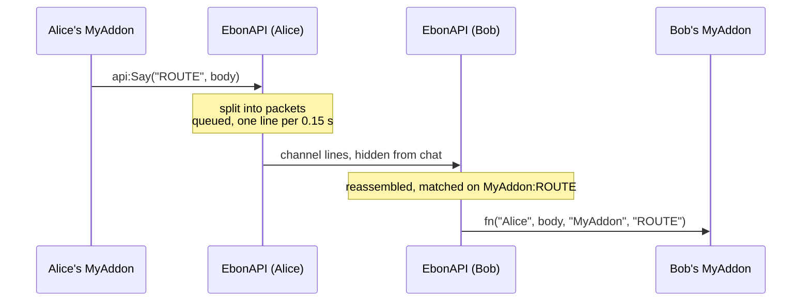

# 📡 Channel

Broadcast a line to every player who runs your addon, on one hidden chat channel shared by every EbonAPI addon.

## What it does

- Joins one custom chat channel at login and keeps it out of every chat window.
- Sends your lines under your addon name and an **op** you choose. Only listeners of that addon and op receive them.
- Splits long bodies into packets and reassembles them on the other side.
- Never delivers your own lines back to you.

## Quick example

```lua
local api = EbonAPI:NewAddon("MyAddon", 1, 0)

api:OnChannel("HELLO", function(sender, body)
  api:Print(sender .. " says: " .. body)
end)

api:On("CHANNEL_JOINED", function()
  api:Say("HELLO", "hi from " .. UnitName("player"))
end)
```

## How it works



**Joining.** EbonAPI joins the channel as soon as an addon is registered, right after `READY`. `CHANNEL_JOINED` fires then, with the channel index; it is sticky. If the client drops the channel, `CHANNEL_LOST` fires and EbonAPI rejoins on its own, once per second until it works. When the client has no channel slot left, the player gets a warning in chat and EbonAPI keeps trying.

**Sending.** `api:Say(op, body)` splits the body into packets, each tagged with your addon name and the op, and queues them. They leave one every 0.15 seconds, behind any server message. `Say` returns `true` when every packet is queued, `false` when the channel is not joined yet or the queue has no room for the whole body.

**Receiving.** A line tagged with your addon name and an op you listen to is delivered to your callback: `fn(sender, body, addon, op)`. `sender` is the character name without the realm. A body split over several packets is delivered once, complete, as long as its packets arrive within 30 seconds.

**Who hears you.** Every player online with EbonAPI and an addon listening to your addon name and op. Players without your addon receive the lines and ignore them.

## Rules for the body

- A string, without the `|` character: the client would read it as a formatting code. Numbers and tables need your own encoding.
- Any text, accents included. Packets are cut between characters, never inside one.
- Up to 16 packets. With a short addon name and op, that is about 3,600 bytes. A longer body is a contract error whose message gives the exact limit.
- Keep the op short: it travels in every packet and reduces the room left for the body.

## API

| Method | Arguments | Returns | Raises when |
| --- | --- | --- | --- |
| `api:OnChannel(op, fn)` | op, `fn(sender, body, addon, op)` | `true`, or `false` if already registered | op is not alphanumeric, fn is not a function |
| `api:OffChannel(op, fn)` | op, function | `true` if something was removed | |
| `api:Say(op, body?)` | op, string | `true` when queued, `false` when not joined or no room | op invalid, body not a string, body contains `\|`, body too long |
| `api:IsChannelJoined()` | | `true` while joined | |

## Events

| Event | Arguments | Sticky | When |
| --- | --- | --- | --- |
| `CHANNEL_JOINED` | channel index | yes | the channel is joined |
| `CHANNEL_LOST` | | no | the client dropped the channel; a rejoin starts |
| `SEND_FAILED` | `"channel"`, line | no | the client refused a line |

## Limits

| | Value |
| --- | --- |
| Packets per body | 16 |
| Body size | about 3,600 bytes with short names; the error message gives the exact figure |
| Reassembly | packets must arrive within 30 seconds |
| Queue | 500 lines for every addon together, one line every 0.15 seconds |

!!! tip "🎮 Try it"
    `/eapi status` shows the channel line: joined with its index and for how long, or joining with the number of requests. `/eapi trace 20 chan` lists the lines received, with their addon, op and size.

## See also

- [Whispers](whispers.md) to reach one player instead of everyone.
- [Sharing](sharing.md) when what you want is a dataset that every player ends up with, without writing the exchange yourself.
