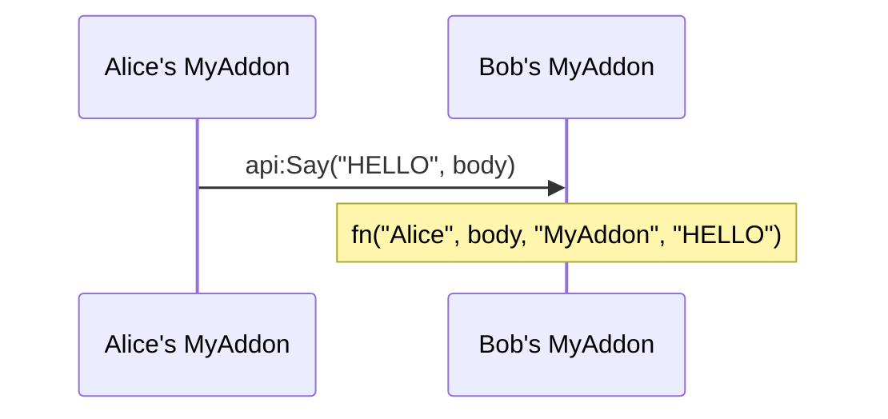

# 📡 Channel

Send a message to the players online who run EbonAPI; those who run your addon receive it. It travels through the hidden chat channel that every EbonAPI addon shares.

## What it does

- Joins the hidden channel for you and keeps it out of every chat window.
- Labels each message with your addon name and an **op**: a short word you choose to say what kind of message it is, such as `ROUTE` or `HELLO`. Only the functions listening to that addon and that op receive it.
- Accepts long bodies and delivers each one to the other players in one piece.
- Never delivers your own messages back to you.

## Quick example

```lua
local api = EbonAPI:NewAddon("MyAddon", 1, 0)

local L = api:Locale({
  enUS = { HELLO_SAID = "%s says: %s" },
  frFR = { HELLO_SAID = "%s dit : %s" },
})

api:OnChannel("HELLO", function(sender, body)
  api:Print(string.format(L.HELLO_SAID, sender, body))
end)

api:On("CHANNEL_JOINED", function()
  api:Say("HELLO", "hi from " .. UnitName("player"))
end)
```

## How it works



**Joining.** EbonAPI joins the channel once an addon uses it, shortly after login. `CHANNEL_JOINED` then fires with the channel's number; it is sticky, so subscribing late still calls you at once. If the game drops the channel, `CHANNEL_LOST` fires and EbonAPI joins again on its own. If the player already uses every channel slot the game allows, EbonAPI keeps trying, prints this warning in chat and records it in **Diagnostics → Reports → Trace**: `channel ebonapi not joined after 4 requests: the client may have no channel slot left; still trying`.

**Sending.** `api:Say(op, body)` returns `true` when your body is queued. It returns `false` when nothing was sent: the channel is not joined yet, or the queue has no room for the whole body. Wait for `CHANNEL_JOINED` before you call it, as the example does. A queued body leaves at one item every 0.15 seconds. An item is one part of a body, so a long body takes several items and a moment to go out.

**Receiving.** Your function gets `fn(sender, body, addon, op)`. `sender` is the character name without the realm. A long body is delivered once, complete. If its parts stop arriving for 30 seconds, it is discarded.

**Who receives it.** Every online player whose EbonAPI has joined the channel receives the message. Only the addons listening to your addon name and op are called; for every other player it is ignored.

**When your addon unloads.** Every listener your handle added is removed.

## Rules for the body

- A string, without the `|` character: the client would read it as a formatting code. Numbers and tables need your own encoding.
- Any text, accents included.
- Up to about 3,600 bytes with a short addon name and op. A longer body is a contract error whose message gives the exact limit.
- Keep the op short: the longer your addon name and op, the less room is left for the body.
- The addon name is always your handle's own name. You cannot send under another name.

## API

| Method | Arguments | Returns | Raises when |
| --- | --- | --- | --- |
| `api:OnChannel(op, fn)` | op, `fn(sender, body, addon, op)` | `true`, or `false` if this function is already registered for this op | op is not a string of letters and digits, fn is not a function |
| `api:OffChannel(op, fn)` | op, function | `true` if something was removed | |
| `api:Say(op, body?)` | op, string (empty when omitted) | `true` when queued, `false` when nothing was sent | op invalid, body not a string, body contains `\|`, body too long, op too long |
| `api:IsChannelJoined()` | | `true` while the channel is joined | |

## Events

| Event | Arguments | Sticky | When |
| --- | --- | --- | --- |
| `CHANNEL_JOINED` | channel number | yes | the channel is joined, at login and after each loss |
| `CHANNEL_LOST` | | no | the game dropped the channel; EbonAPI joins again |
| `SEND_FAILED` | `"channel"`, the raw line EbonAPI tried to send (a part of your body with EbonAPI's header in front) | no | the game refused an item when EbonAPI sent it |

## Limits

| | Value |
| --- | --- |
| Body size | about 3,600 bytes with short names; the error message gives the exact figure |
| Incomplete body | discarded after 30 seconds without a new part |
| Queue | 500 waiting items for channel messages and whispers together (a body takes one item per part), one item leaving every 0.15 seconds |

### Error messages

| Message | When |
| --- | --- |
| `EbonAPI.Channel.on expects an alphanumeric op for MyAddon, got <value>` | `OnChannel` with an invalid op |
| `EbonAPI.Channel.on expects a function for MyAddon:HELLO, got <type>` | `OnChannel` without a function |
| `EbonAPI.Channel.say expects a text body for MyAddon:HELLO, got <type>` | `Say` with a body that is not a string |
| `EbonAPI.Channel.say: the body of MyAddon:HELLO contains '\|'` | `Say` with a `\|` in the body |
| `EbonAPI.Channel.say: body of <length> characters for MyAddon:HELLO, the limit is <limit>` | the body is too long |
| `EbonAPI.Channel.say: op too long for MyAddon:HELLO` | the addon name and op leave no room for a body |

`Say` with an invalid op raises the same op message as `OnChannel`, starting with `EbonAPI.Channel.say`.

!!! tip "🎮 Try it"
    **Diagnostics → Reports → Status** in the EbonAPI window shows the channel line: `channel ebonapi: joined (index 5, for 120s)` once joined, `channel ebonapi: joining... (2 requests)` while joining, `channel ebonapi: not needed by any consumer` when no addon uses it. **Diagnostics → Reports → Trace**, with the **Trace filter** on `chan`, lists the messages received, with their addon, op and size.

## See also

- [Whispers](whispers.md) to reach one player instead of everyone.
- [Sharing](sharing.md) when what you want is a dataset that every player ends up with, without writing the exchange yourself.
