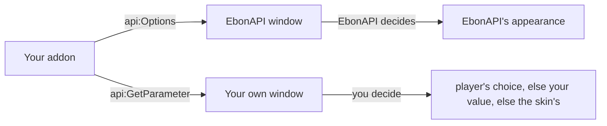

# 🪟 Interface

One window for EbonAPI and the addons that use it, and one set of appearance parameters every addon can follow.

## What it does

- EbonAPI has its own window: a column of tabs, pages with titled groups of settings, and a search box that finds an option by name.
- EbonAPI's own settings live there: the language, the appearance, the connected addons, and the diagnostics. There are no slash commands. Players open the window from the game menu (**Esc → EbonAPI**), from **Interface → AddOns → EbonAPI**, or from the EbonAPI minimap button.
- Your addon can hand all of its interface, or only part of it, to EbonAPI: describe the settings in an options table and EbonAPI draws them in its window. Your addon keeps its logic.
- Your addon can also keep its own interface and read EbonAPI's appearance parameters, with values of its own.
- To build that interface, the [Kit](kit.md) gives you windows and elements that follow the player's skin.

EbonAPI imposes how options are written, not which options you offer.

## Quick example

Settings drawn by EbonAPI, in the EbonAPI window:

```lua title="MyAddon.lua"
local api = EbonAPI:NewAddon("MyAddon", 1, 0)
local db = api:DB({ account = { sounds = true, volume = 0.5, mode = "fast" } })
local L = api:Locale({
  enUS = { SOUNDS = "Play sounds", VOLUME = "Volume", MODE = "Mode", FAST = "Fast", SAFE = "Safe" },
  frFR = { SOUNDS = "Jouer les sons", VOLUME = "Volume", MODE = "Mode", FAST = "Rapide", SAFE = "Sûr" },
})

api:Options({
  type = "group",
  name = "MyAddon",
  get = function(info)
    return db.account[info[#info]]
  end,
  set = function(info, value)
    db.account[info[#info]] = value
  end,
  args = {
    sounds = { type = "toggle", order = 1, name = function() return L.SOUNDS end },
    volume = {
      type = "range", order = 2, name = function() return L.VOLUME end,
      min = 0, max = 1, step = 0.05, isPercent = true,
    },
    mode = {
      type = "select", order = 3, name = function() return L.MODE end,
      values = function() return { fast = L.FAST, safe = L.SAFE } end,
    },
  },
})
```

Your own window, following the appearance the player chose:

```lua title="MyAddon.lua"
local api = EbonAPI:NewAddon("MyAddon", 1, 0)
local frame = CreateFrame("Frame", "MyAddonFrame", UIParent)

frame:SetBackdrop({ bgFile = "Interface\\Buttons\\WHITE8X8", edgeFile = "Interface\\Buttons\\WHITE8X8", edgeSize = 1 })

api:SetParameter("accent", 0x3FA7F5)

local function rgb(color)
  return math.floor(color / 65536) / 255, math.floor(color / 256) % 256 / 255, color % 256 / 255
end

local function paint()
  local r, g, b = rgb(api:GetParameter("background"))

  frame:SetBackdropColor(r, g, b, api:GetParameter("opacity"))
  frame:SetBackdropBorderColor(rgb(api:GetParameter("accent")))
  frame:SetScale(api:GetParameter("scale"))
end

api:On("PARAMETER_CHANGED", paint)
paint()
```

## How it works

**Two cases, not to be confused.**



- **In the EbonAPI window, EbonAPI decides.** Every page, yours included, follows EbonAPI's appearance. The values your addon set with `api:SetParameter` do not apply there.
- **In your own window, you keep control.** `api:GetParameter(name)` returns the player's choice when there is one, otherwise your own value, otherwise the value of the player's skin. The player has the last word.

### Parameters

EbonAPI offers these parameters. The player sets them in **Appearance**; the **Defaults** button gives every parameter its default back, and your values apply again. The defaults below are those of Azeroth, the default skin; each [skin](skins.md) gives its own.

| Name | Kind | Default | Range |
| --- | --- | --- | --- |
| `background` | color `0xRRGGBB` | `0x000000` | any color |
| `accent` | color `0xRRGGBB` | `0xFFD100` | any color |
| `scale` | number | `1` | `0.2` to `1.4` |
| `opacity` | number, background alpha | `1` | `0.25` to `1` |
| `shadow` | number, shadow under windows | `0.5` | `0` to `1` |
| `corners` | whole number | `0`, sharp | `0` to `16`, softer as it grows |
| `tabs` | `"LEFT"` or `"RIGHT"` | `"LEFT"` | |
| `locked` | boolean, window positions locked | `false` | |

The player's choices are saved for the account. Your own values are not saved: set them at every load, before you draw. `api:SetParameter(name, nil)` removes yours.

### The options table

The root is a group; its `args` table lists the options, each under a key of your choice that does not change between versions. EbonAPI knows the nine types below and the fields listed after them.

| Type | Draws | Specific fields |
| --- | --- | --- |
| `group` | a tab in the column, or a titled box with `inline = true` | `args`, `inline` |
| `header` | a title across the page, its `name` | |
| `description` | a paragraph, its `name` | `fontSize`: `"small"`, `"medium"`, `"large"` |
| `toggle` | a check box | |
| `range` | a slider with its minimum, maximum and value | `min`, `max`, `softMin`, `softMax`, `step`, `isPercent` |
| `select` | a drop-down list | `values`, `sorting` |
| `color` | a color swatch | `hasAlpha` |
| `execute` | a button | `func` |
| `input` | a text field | `multiline` |

- `range` needs `min` and `max`, with `min` below `max`. The slider shows `softMin` to `softMax` when you give them, and the value is always kept between `min` and `max`. `step` defaults to `0.01` with `isPercent`; otherwise to `1` when the slider's range is 10 or more wide, else `0.01`. The slider's range is `softMin` to `softMax` when you give them, otherwise `min` to `max`.
- `select` takes `values` as a table `{ key = text }`, or a function or method name returning one. The choices are sorted by text. With `sorting`, a list of keys, only those keys are shown, in that order.
- `input` with `multiline = true` is a box of several lines; give a number for the number of lines.
- `toggle`, `range`, `select`, `color` and `input` need `get` and `set`, on themselves or on a parent group. `execute` needs `func`. `group` needs `args`.

Every option requires `name` and may declare `desc` (its tooltip), `order`, `width`, `disabled`, `hidden`, `arg` and `handler`.

- `order` is a number, `100` when missing. Options with the same order are sorted by name.
- `width` is `"half"`, `"normal"` (the default), `"double"`, `"full"`, or a number of standard widths. A standard width is 170 pixels in the default skin.
- `get`, `set`, `func` and `handler` come from the nearest parent group that defines them when the option has none. `disabled` is read the same way. `hidden = true` on a group hides everything inside it.
- A field may be a literal value or a function. `get`, `set`, `func`, `disabled`, `hidden` and `values` may also be the name of a method of `handler`.
- The root group may have an `icon`; without one, your addon's icon is used.
- `arg` is any value of yours; callbacks get it back as `info.arg`. `handler` is a table of your methods: a field given as a method name calls `handler[name](handler, info, ...)`.

Every callback receives an `info` table first. `info[1]`, `info[2]`, ... are the keys from the root down to the option, so `info[#info]` is the option's own key: that is how the quick example reads and writes the right entry of `db.account`. `info` also has the fields `option`, `options` (the root table), `arg`, `handler`, `type`, `uiType` (always `"dialog"`), and `uiName` and `appName` (both the addon name). A `set` callback receives the new value after `info`. A color `get` callback returns `r, g, b, a`; its `set` callback receives those four numbers after `info`.

**Layout.** The root of your table is your addon's tab. A group directly under the root becomes a tab under it in the column, unless it has `inline = true`; it is then a titled box on your root page. Groups deeper than that are always titled boxes.

**Names in the player's language.** A `name` given as a string does not change. Give a function, as the quick example does, so that the name follows a language change:

```lua
sounds = { type = "toggle", name = function() return L.SOUNDS end },
```

**Validation.** `api:Options` checks the whole table and raises with the path of the faulty option, such as `option "general.volume"`. See [Errors](../reference/errors.md#interface). EbonAPI keeps your table itself, not a copy, and does not check it again: a change you make later is not validated. Calling `api:Options` again replaces the table.

While a page is drawn, an option whose `get`, `desc`, `disabled` or `values` raises is left out and the error is reported; the rest of the page is drawn. A `set` or `func` that raises when the player uses the option is reported too.

**Refresh.** After the player changes an option or presses a button, EbonAPI draws the page again, so `hidden` and `disabled` follow. When your values change from elsewhere, call `api:RefreshOptions()`.

**Search.** The search box finds options by name, whatever the case, in the tabs of every addon. Groups, headers and descriptions are not searched.

## API

| Method | Arguments | Returns | Raises when |
| --- | --- | --- | --- |
| `api:Options(options)` | options table | the table | the table is not valid; the message names the option |
| `api:RefreshOptions()` | | | |
| `api:OpenOptions(key?)` | optional key of one of your groups | the window | called before `api:Options` |
| `api:GetParameter(name)` | parameter name | the value that applies to your addon | the name is unknown |
| `api:GetParameters()` | | a table, name to value | |
| `api:SetParameter(name, value)` | name, value or `nil` to remove yours | the value that applies, the player's when set | the name is unknown or the value out of range |
| `EbonAPI:OpenOptions(addon?, key?)` | optional addon and group | the window | |
| `EbonAPI:GetParameter(name)` | parameter name | the value in the EbonAPI window | the name is unknown |

`api:OpenOptions` opens the window on your tab. The messages of the errors are in [Errors](../reference/errors.md#interface).

## Events

| Event | Arguments | Sticky | When |
| --- | --- | --- | --- |
| `PARAMETER_CHANGED` | name, value | no | the player changed a parameter, or pressed **Defaults**; `value` is the one of the EbonAPI window, read yours again with `api:GetParameter` |
| `OPTIONS_CHANGED` | addon name | no | an addon registered its options or called `api:RefreshOptions` |

`api:SetParameter` does not send `PARAMETER_CHANGED`: repaint yourself after you call it.

## Limits

| | Value |
| --- | --- |
| Parameters | the eight in the table above |
| Option types | the nine in the table above |
| Tabs in the column | your root and one level of groups |
| Width unit | 170 pixels in the default skin |

!!! tip "🎮 Try it"
    **Esc → EbonAPI → Appearance**: change the accent under **Colors** and the window repaints at once; set **Tabs** to **On the right** under **Layout** and the column moves. Type `vol` in the search box to find the Volume option of the first example.

## See also

- [Storage](storage.md) for the `api:DB` table the `get` and `set` of the example read and write.
- [Localization](localization.md) for names that follow the player's language.
- [Options window](../reference/options-window.md) for EbonAPI's own pages and its diagnostics.
- [Kit](kit.md) for your own windows, and [Skins](skins.md) for the look they follow.
