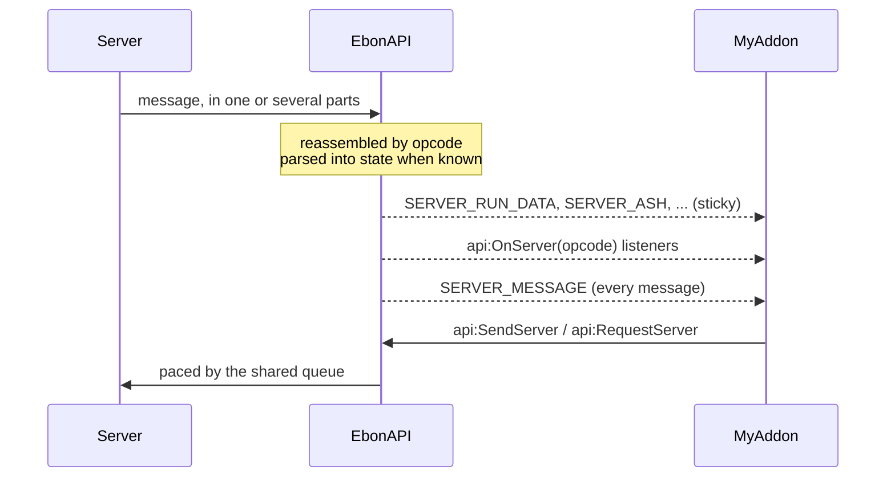

# 🛰️ Server

Receive what the Ebonhold server tells the client, as parsed state and events or as raw messages by opcode. Send it requests through the shared queue.

## What it does

The Ebonhold server talks to the client through addon messages, each carrying an **opcode** and a body. EbonAPI reads them, reassembles the long ones, and:

- parses the important ones into **state** you can read at any time, and into sticky **events**;
- hands every message, parsed or not, to the listeners of its opcode;
- sends your own messages to the server, paced by the shared queue, with throttling for requests.

## Quick example

```lua
local api = EbonAPI:NewAddon("MyAddon", 1, 0)

api:On("SERVER_RUN_DATA", function(event, run)
  api:Print("Soul Ashes: " .. run.soulPoints .. " / " .. run.soulPointsMax)
end)

api:On("SERVER_ASH", function(event, ash)
  api:Print(ash.spendable .. " to spend, " .. ash.committed .. " committed")
end)

api:On("READY", function()
  -- Ask the server for the list of builds, at most once every 30 seconds.
  api:RequestServer(EbonAPI.CS.REFRESH_BUILDS, "", 30)
end)
```

## How it works



Every message reaches three places, in this order: the state parser, the `api:OnServer` listeners of its opcode, then every `SERVER_MESSAGE` listener.

## Parsed events

These events carry ready-to-use tables. All of them are sticky: a late subscriber gets the last value at once.

| Event | Argument | Fed by |
| --- | --- | --- |
| `SERVER_RUN_DATA` | run | `SS.PLAYER_RUN_DATA` |
| `SERVER_INTENSITY` | intensity | `SS.PLAYER_INTENSITY_POINTS` |
| `SERVER_ASH` | ash, only when the amounts changed | `SS.COMMITTED_SOUL_POINTS`, `SS.SEND_LOADOUTS` |
| `SERVER_MULTIPLIER` | number | `SS.SOUL_POINTS_MULTIPLIER` |
| `SERVER_BUILDS` | builds | `SS.BUILD_LIST` |
| `SERVER_BUILD_ACTIVE` | slot, builds | `SS.BUILD_ACTIVE` |
| `SERVER_LOADOUT` | loadout | `SS.SEND_LOADOUTS` |

### Run

| Field | Meaning |
| --- | --- |
| `soulPoints`, `soulPointsMax` | Soul Ashes of the run and the cap |
| `acceptedRezs`, `acceptedRezsMax`, `countCanAcceptedRezs` | resurrections accepted, allowed, remaining |
| `selfRezs`, `selfRezsMax`, `countCanSelfRezs` | self-resurrections used, allowed, remaining |
| `classRezs`, `classRezsMax`, `countCanClassRezs` | class resurrections used, allowed, remaining |
| `avoidedFatalAttacks`, `avoidedFatalAttacksMax`, `countCanAvoidFatalAttacks` | fatal attacks avoided, allowed, remaining |
| `nbResetAvoided`, `costNextReset` | resets avoided so far, cost of the next one |
| `usedRerolls`, `totalRerolls`, `remainingRerolls` | rerolls used, granted, remaining |
| `remainingBanishes` | banishes left |
| `catchupMultiplierPct` | catch-up multiplier, in percent |
| `usedFreezes`, `totalFreezes`, `remainingFreezes` | freezes used, granted, remaining |
| `hasReachedMaxLevel` | `true` once the run reached the level cap |
| `fieldCount` | how many fields the server sent; older servers send fewer |

### Intensity

`intensity` (number), `areaName` (string), `onCooldown` (boolean).

### Ash

`spendable` and `committed` (numbers), `source` (the opcode that delivered them), `at` (the `GetTime()` of the delivery).

### Builds

`active` (slot number), `maxSlots`, `unlocked`, `prices` (list of numbers), and `slots`, a table keyed by slot number where each entry has `slot`, `name` and `echoes`. Use the state helpers to read the echoes:

```lua
local State = api:State()

for _, build in ipairs(State.sortedBuilds()) do
  local echoes = State.BuildEchoes(build)        -- { { spellId, stacks, locked }, ... }
  api:Print(build.slot .. " " .. build.name .. ": " .. #echoes .. " echoes")
end

local build, slot = State.activeBuild()
```

### Loadout

`id`, `name`, `nodes` (a table keyed by node id giving the rank), `count` (how many loadouts the server listed), and `spendable` and `committed` when the message carried them.

## Reading the state at any time

`api:State()` returns the state module. Every getter returns `nil` while nothing has been received.

| Function | Returns |
| --- | --- |
| `State.GetRun()` | the run table, or ProjectEbonhold's published run data when no message arrived yet |
| `State.GetIntensity()` | the intensity table, with the same fallback |
| `State.GetAsh()` | the ash table |
| `State.GetMultiplier()` | the multiplier, `0` by default |
| `State.GetBuilds()` | the builds table |
| `State.GetLoadout()` | the loadout table |
| `State.RunAshes()` | `soulPoints, soulPointsMax` as integers |
| `State.HasServer()` | `true` once ProjectEbonhold is present or a message was received |
| `State.snapshot(name)` | a deep copy of `"run"`, `"intensity"`, `"ash"`, `"builds"` or `"loadout"` |

!!! warning
    The tables are updated in place when the next message arrives. If you keep one, keep a copy: `State.snapshot("run")`.

## Raw messages

For opcodes EbonAPI does not parse, or to read the body yourself:

```lua
api:OnServer(EbonAPI.SS.HARDMODE_DATA, function(body, opcode, sender)
  api:Debug("hardmode: " .. body)
end)
```

The callback receives the complete body, reassembled when the server split it. `api:OffServer(opcode, fn)` removes it. `SERVER_MESSAGE(opcode, body, sender)` fires for every message, whatever its opcode. `STREAM_TIMEOUT(opcode, id, received, total)` fires when a multi-part message did not complete within 20 seconds.

## Sending

```lua
api:SendServer(EbonAPI.CS.BUILD_SELECT, "3")
api:RequestServer(EbonAPI.CS.REFRESH_PERKS, "", 30)
```

- `api:SendServer(opcode, body)` queues the message and returns `true`. The body is optional.
- `api:RequestServer(opcode, body, minInterval)` does the same, but returns `false` without sending when the same opcode and body left less than `minInterval` seconds ago. Use it for refresh requests that several places of your addon may trigger.
- Opcode and body together cannot exceed 240 bytes. A longer message is a contract error.

Server messages go first in the shared queue, ahead of channel lines and whispers.

## Opcodes

`EbonAPI.SS` names the opcodes the server sends, `EbonAPI.CS` the ones the client sends. Use the names; the numbers appear in `/eapi trace` and `/eapi opcodes`.

| `EbonAPI.SS` | Number | Content |
| --- | --- | --- |
| `SEND_LOADOUTS` | 3 | loadouts of the skill tree, with the ashes |
| `INSTANCE_ENTERED` | 9 | an instance was entered |
| `INSTANCE_ENCOUNTERS_COMPLETED` | 10 | encounters completed in the instance |
| `JUNK_SOLD` | 12 | junk sold |
| `PLAYER_RUN_DATA` | 13 | the run, parsed into `SERVER_RUN_DATA` |
| `SOUL_POINTS_MULTIPLIER` | 14 | parsed into `SERVER_MULTIPLIER` |
| `COMMITTED_SOUL_POINTS` | 15 | parsed into `SERVER_ASH` |
| `PLAYER_PERK_CHOICE` | 16 | perks offered |
| `PLAYER_PERK_GRANTED` | 18 | a perk was granted |
| `PLAYER_INTENSITY_POINTS` | 30 | parsed into `SERVER_INTENSITY` |
| `PLAYER_SPEC_INDEX` | 32 | the active specialization |
| `OBJECTIVES_PROPOSALS` | 101 | objectives on offer |
| `CURRENT_OBJECTIVE` | 102 | the current objective |
| `HARDMODE_DATA` | 500 | hardmode state |
| `BUILD_LIST` | 540 | parsed into `SERVER_BUILDS` |
| `BUILD_ACK` | 541 | a build change was acknowledged |
| `BUILD_ACTIVE` | 542 | parsed into `SERVER_BUILD_ACTIVE` |
| `CHECKPOINTS_DATA` | 800 | checkpoints |
| `ORBS` | 1220 | orbs |

| `EbonAPI.CS` | Number | Asks the server to |
| --- | --- | --- |
| `PERK_SELECT` | 17 | select a perk |
| `REFRESH_PERKS` | 330 | send the perks again |
| `REFRESH_BUILDS` | 340 | send the build list again |
| `BUILD_SAVE` | 341 | save a build |
| `BUILD_SELECT` | 344 | select a build |
| `ORBS` | 1220 | send the orbs |
| `ORB_FORGET` | 1221 | forget an orb |

The bodies of the opcodes EbonAPI does not parse belong to the server protocol; read them with `api:OnServer`.

## API

| Method | Arguments | Returns | Raises when |
| --- | --- | --- | --- |
| `api:OnServer(opcode, fn)` | number, `fn(body, opcode, sender, distribution)` | `true`, or `false` if already registered | opcode is not a number, fn is not a function |
| `api:OffServer(opcode, fn)` | number, function | `true` if something was removed | |
| `api:SendServer(opcode, body?)` | number, string | `true` | opcode is not a number, message over 240 bytes |
| `api:RequestServer(opcode, body, minInterval)` | number, string, seconds | `true`, or `false` when throttled | same as `SendServer` |
| `api:State()` | | the state module | |

## Events

| Event | Arguments | Sticky | When |
| --- | --- | --- | --- |
| `SERVER_RUN_DATA` | run | yes | run data received |
| `SERVER_INTENSITY` | intensity | yes | intensity received |
| `SERVER_ASH` | ash | yes | the ash amounts changed |
| `SERVER_MULTIPLIER` | number | yes | multiplier received |
| `SERVER_BUILDS` | builds | yes | build list received |
| `SERVER_BUILD_ACTIVE` | slot, builds | yes | the active build changed |
| `SERVER_LOADOUT` | loadout | yes | loadouts received |
| `SERVER_MESSAGE` | opcode, body, sender | no | any complete message |
| `STREAM_TIMEOUT` | opcode, id, received, total | no | a multi-part message expired |

## Limits

| | Value |
| --- | --- |
| Outgoing message, opcode and body | 240 bytes |
| Incoming message | up to 400 parts, complete within 20 seconds |
| Queue pace | one message every 0.15 seconds, shared by every addon |

!!! tip "🎮 Try it"
    `/eapi trace 20 recv` lists the last messages received with their opcode names and sizes. `/eapi opcodes` prints both tables. The bridge line of `/eapi status` counts messages received, sent and still queued.

## See also

- [ProjectEbonhold](ebonhold.md) for the client's own services and its way of sending.
- [Modules](../reference/modules.md) for every function of `EbonAPI.State`.
- [Cookbook: run tracker](../cookbook/run-tracker.md) for a complete example built on `SERVER_RUN_DATA`.
