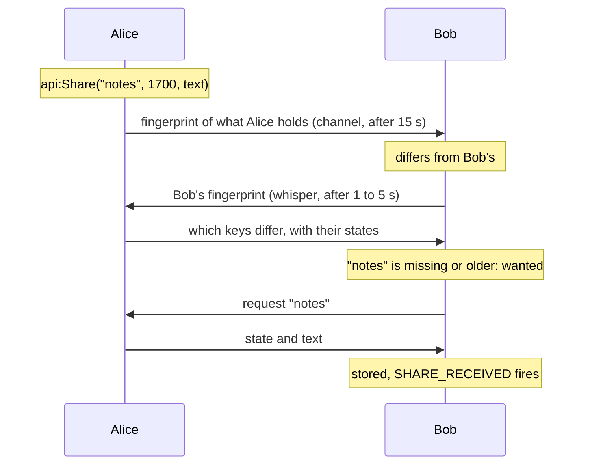

# 🔄 Sharing

Publish a dataset under a name and a state. EbonAPI spreads it between players until everyone holds the newest version, and tells you when something new arrives.

## What it does

- You publish **datasets**: a name, a **state** (a whole number that grows with each change) and a **text** (the content, up to 32 KB).
- EbonAPI compares what players hold, fetches what is missing or newer, and stores it in the saved data. Every player who runs EbonAPI ends up with every dataset, even for addons they do not have.
- Your addon reads any dataset, its own or another addon's, at any time, and hears `SHARE_RECEIVED` when a new version arrives.

## Quick example

```lua
local api = EbonAPI:NewAddon("MyAddon", 1, 0)

-- Publish, or republish after a change. The state is the time of the change.
local function publishNotes(text)
  api:Share("notes", time(), text)
end

-- Read what we hold, ours or received from another player.
local text, state = api:GetShared("notes")

-- Learn when a newer version arrived from someone.
api:On("SHARE_RECEIVED", function(event, addon, name, state, sender)
  if addon == "MyAddon" and name == "notes" then
    api:Print("notes updated by " .. sender)
  end
end)
```

## How it works



**Keys and fingerprint.** Each dataset is a key: your addon name, the dataset name and its state. EbonAPI hashes the keys of each addon into one fingerprint and announces it on the channel: 2 seconds after joining, 15 seconds after a change, and on `api:SyncShares()`.

**Exchange.** A player whose fingerprint differs answers, over whispers: the addons that differ, then the keys of those addons with their states. Each side fetches what it lacks or holds in an older state, one dataset per request. A dataset received is stored and served to the next player, whether or not the addon that owns it is installed there.

**Rounds.** Every 2 minutes, each player picks one peer at random among those whose fingerprint still differs and starts the exchange again. Peers silent for 10 minutes are forgotten. This is the classic anti-entropy scheme: every dataset reaches every player, however they were connected.

**Persistence.** Datasets live in EbonAPI's saved data. They survive reloads and log-outs, and are announced again at the next login.

## The state

The state is a whole number from 0 to 2^53, given as a number or as a string of digits. It comes back as a string of digits: compare with `tonumber`.

The default rule: a player fetches a dataset they do not hold, or hold in a lower state. Two equal states mean the same content, so **raise the state every time the text changes**. The time of the change, `time()`, is the simplest choice; a counter works too.

To decide yourself, give a rule:

```lua
api:ShareRule(function(name, theirState, myState)
  if name == "notes" then
    return myState == nil or tonumber(theirState) > tonumber(myState)
  end

  return false     -- never fetch the other datasets of this addon
end)
```

The rule runs on the receiving side, for your addon's datasets only. `myState` is `nil` when you hold nothing. An error inside the rule is reported and counts as `false`.

## Retiring a dataset

`api:Unshare(name)` removes your copy and takes the key out of your fingerprint. Other players keep theirs, and the default rule fetches it back for you at the next exchange, since you no longer hold it.

To retire a dataset for everyone, publish an empty text with a higher state. Every player fetches the empty version.

## Reading other addons

Datasets are readable across addons. This is how EbonAPI links what each addon knows:

```lua
local text, state = api:GetShared("routes", "AutoCallboard")

for _, name in ipairs(api:SharedNames("AutoCallboard")) do
  api:Debug("AutoCallboard shares " .. name)
end
```

Only the addon that owns a dataset publishes it. Reading is open to all.

## Keys without text

`api:SetShareKey(name, state)`, `api:RemoveShareKey(name)` and `api:GetShareKey(name, addon?)` handle the key alone. A key without text tells other players that a state exists, but EbonAPI has nothing to send them when they ask. Use `api:Share` unless your addon carries the content by its own means.

## API

| Method | Arguments | Returns | Raises when |
| --- | --- | --- | --- |
| `api:Share(name, state, text)` | name, whole number, string | `true` when something changed | name invalid, state not a whole number in range, text not a string or over 32,768 bytes |
| `api:Unshare(name)` | name | `true` if it existed | |
| `api:GetShared(name, addon?)` | name, optional addon name | `text, state`, or `nil` | |
| `api:SharedNames(addon?)` | optional addon name | sorted list of names | |
| `api:ShareRule(fn)` | `fn(name, theirState, myState)` or `nil` | `true` | fn is neither a function nor `nil` |
| `api:SyncShares()` | | `true` when announced, `false` within 30 seconds of the last manual call or when not joined | |
| `api:SetShareKey(name, state)` | name, whole number | `true` when changed | name or state invalid |
| `api:RemoveShareKey(name)` | name | `true` if it existed | |
| `api:GetShareKey(name, addon?)` | name, optional addon name | state, or `nil` | |

## Events

| Event | Arguments | Sticky | When |
| --- | --- | --- | --- |
| `SHARE_RECEIVED` | addon, name, state, sender | no | a dataset arrived from another player; fires for every addon's datasets |
| `SHARE_KEY_CHANGED` | addon, name, state or `nil` | no | a key changed on this player, by your call or by a fetch |

## Limits

| | Value |
| --- | --- |
| Dataset name | 1 to 32 characters, `A-Z a-z 0-9 _` |
| State | whole number, 0 to 9,007,199,254,740,991 |
| Text | 32,768 bytes |
| Announce delay | 2 seconds after joining, 15 seconds after a change |
| Manual announce | one every 30 seconds |
| Rounds | every 2 minutes, one peer at random |
| Peer memory | 10 minutes without news |
| Fetch timeout | 30 seconds |

!!! tip "🎮 Try it"
    The shares line of `/eapi status` counts keys, addons, players seen, datasets received and refused. `/eapi trace 20 share` shows the exchanges as they happen.

## See also

- [Cookbook: shared dataset](../cookbook/shared-dataset.md) for a complete example with a state, a rule and a reader.
- [Channel](channel.md) and [Whispers](whispers.md) for exchanges you write yourself.
