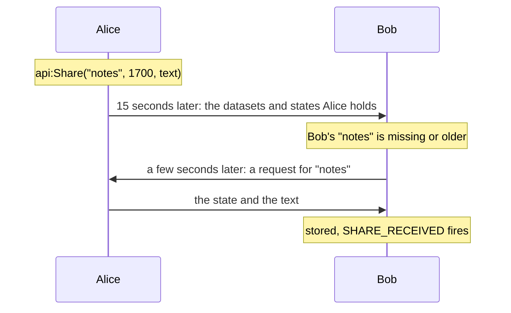

# 🔄 Sharing

Publish a dataset under a name and a state. EbonAPI spreads it between players until everyone holds the newest version, and tells you when something new arrives.

## What it does

- You publish **datasets**: a name, a **state** (a whole number that grows with each change) and a **text** (the content, up to 32 KB).
- EbonAPI compares what players hold, fetches what is missing or newer, and stores it in the saved data. Every player who runs EbonAPI ends up with every dataset, even for addons they do not have.
- Your addon reads any dataset, its own or another addon's, at any time, and hears `SHARE_RECEIVED` when a new version arrives.

## Quick example

```lua
local api = EbonAPI:NewAddon("MyAddon", 1, 0)

-- Publish, or republish after a change. The state is the time of the change.
local function publishNotes(text)
  api:Share("notes", time(), text)
end

-- Read what we hold, ours or received from another player.
local text, state = api:GetShared("notes")

local L = api:Locale({
  enUS = { NOTES_UPDATED = "Notes updated by %s" },
  frFR = { NOTES_UPDATED = "Notes mises à jour par %s" },
})

-- Learn when a newer version arrived from someone.
api:On("SHARE_RECEIVED", function(event, addon, name, state, sender)
  if addon == "MyAddon" and name == "notes" then
    api:Print(string.format(L.NOTES_UPDATED, sender))
  end
end)
```

## How it works



**Announcing.** EbonAPI tells the other players which datasets you hold and in which state: 2 seconds after it joins the channel, 15 seconds after one of your datasets changes, and when you call `api:SyncShares()`. The first change starts the 15 seconds; changes made during that time go out in the same announcement. A player who receives a dataset announces it in turn, 15 seconds later.

**Fetching.** A player whose copy is missing or older asks for it within a few seconds and gets the text. If the other player does not send the text, your copy stays as it was and is compared again at the next periodic comparison. On the receiving side, your `ShareRule`, if you gave one, decides which datasets are taken.

**Catching up.** Every 2 minutes, EbonAPI compares again with one player who still holds different datasets. A player who logged in later, or missed an exchange, ends up with the newest version too. A change is announced 15 seconds after it is made, and every 2 minutes EbonAPI compares again with one player who still differs. Sharing is not instant messaging.

**Keeping.** Datasets are saved for the account. They survive reloads and log-outs, and are announced again at the next login. A player keeps and passes on the datasets of addons they do not have installed. When your addon unloads, only its `ShareRule` is removed; the datasets stay.

## The state

The state is a whole number from 0 to 9,007,199,254,740,991, given as a number or as a string of digits. `5`, `"5"` and `5.0` are the same state. It comes back as a string of digits: compare with `tonumber`.

The default rule: a player fetches a dataset they do not hold, or hold in a lower state. Two equal states mean the same content, so **raise the state every time the text changes**: a new text under the same state is not announced, and other players do not fetch it. The time of the change, `time()`, is the simplest choice; a counter works too.

To decide yourself, give a rule:

```lua
api:ShareRule(function(name, theirState, myState)
  if name == "notes" then
    return myState == nil or tonumber(theirState) > tonumber(myState)
  end

  return false     -- never fetch the other datasets of this addon
end)
```

The rule runs on the receiving side, for your addon's datasets only, and only when the state another player announces differs from yours. Both states are strings of digits; `myState` is `nil` when you hold nothing. The rule returns `true` to fetch. An error inside the rule is reported and counts as `false`. `api:ShareRule(nil)` brings the default rule back.

## Retiring a dataset

`api:Unshare(name)` removes your copy and your key. Other players keep theirs, and the default rule fetches it back for you at the next exchange, since you no longer hold it.

To retire a dataset for everyone, publish an empty text with a higher state. Every player fetches the empty version.

## Reading other addons

Datasets are readable across addons. This is how EbonAPI links what each addon knows:

```lua
local text, state = api:GetShared("routes", "AutoCallboard")

for _, name in ipairs(api:SharedNames("AutoCallboard")) do
  api:Debug("AutoCallboard shares " .. name)
end
```

Only the addon that owns a dataset publishes it. Reading is open to all.

## Keys without text

A **key** is a dataset's name and state, without its text. `api:Share` sets both. `api:SetShareKey(name, state)` sets a key alone, `api:RemoveShareKey(name)` removes one, and `api:GetShareKey(name, addon?)` reads the state of one. `SHARE_KEY_CHANGED` fires when a key changes.

## API

| Method | Arguments | Returns | Raises when |
| --- | --- | --- | --- |
| `api:Share(name, state, text)` | name, whole number, string | `true` when the text or the state changed, `false` when both are the same as before | name invalid, state not a whole number in range, text not a string or over 32,768 bytes |
| `api:Unshare(name)` | name | `true` if the key existed | |
| `api:GetShared(name, addon?)` | name, optional addon name | `text, state`; `nil` for each one that is missing | |
| `api:SharedNames(addon?)` | optional addon name | list of names, sorted | |
| `api:ShareRule(fn)` | `fn(name, theirState, myState)` or `nil` | `true` | fn is neither a function nor `nil` |
| `api:SyncShares()` | | `true` when announced, `false` within 30 seconds of the last call, when the channel is not joined or when the announcement could not be queued | |
| `api:SetShareKey(name, state)` | name, whole number | `true` when the key was created or its state changed | name or state invalid |
| `api:RemoveShareKey(name)` | name | `true` if it existed | |
| `api:GetShareKey(name, addon?)` | name, optional addon name | state as a string of digits, or `nil` | |

## Events

| Event | Arguments | Sticky | When |
| --- | --- | --- | --- |
| `SHARE_RECEIVED` | addon, name, state, sender | no | a dataset arrived from another player and was stored; fires for every addon's datasets |
| `SHARE_KEY_CHANGED` | addon, name, state or `nil` | no | a key was created, changed or removed, by your call or by a fetch; `state` is `nil` for a removal |

## Limits

| | Value |
| --- | --- |
| Dataset name | 1 to 32 characters, letters, digits and `_` |
| State | whole number, 0 to 9,007,199,254,740,991 |
| Text | 32,768 bytes |
| Announcement | 2 seconds after joining the channel, 15 seconds after a change |
| `api:SyncShares()` | once every 30 seconds |
| Catching up | every 2 minutes, with one player who still differs |

### Error messages

`MyAddon` stands for your addon name and `notes` for the dataset name.

| Message | When |
| --- | --- |
| `EbonAPI: MyAddon: share key name must be a string, got <type>` | the name is not a string |
| `EbonAPI: MyAddon: share key name is empty` | the name is `""` |
| `EbonAPI: MyAddon: share key "my notes" contains a space (allowed: letters, digits and "_")` | the name has a character outside letters, digits and `_`; the message names the offender: `a space`, `a control character (byte <n>)` or `the character "<c>"` |
| `EbonAPI: MyAddon: share key "<name>" is <n> characters long (maximum 32)` | the name is over 32 characters |
| `EbonAPI: MyAddon: share key "notes": state must be a whole number, got <type>` | the state is neither a number nor a string |
| `EbonAPI: MyAddon: share key "notes": state <shown> is not a whole number (0 to 9007199254740991)` | the state is negative, fractional, too large or not all digits |
| `EbonAPI: MyAddon: share "notes": text must be a string, got <type>` | `api:Share` with a text that is not a string |
| `EbonAPI: MyAddon: share "notes": text is <n> bytes long (maximum 32768)` | the text is over 32,768 bytes |
| `EbonAPI: MyAddon: ShareRule expects a function or nil, got <type>` | `api:ShareRule` with something else |

!!! tip "🎮 Try it"
    The shares line of **Diagnostics → Reports → Status**, in the EbonAPI window, reads `shares: 1 key(s) from 1 addon(s), 0 player(s) seen, 0 received, 0 refused`. **Diagnostics → Reports → Trace**, with the **Trace filter** on `share`, shows the exchanges as they happen.

## See also

- [Cookbook: shared dataset](../cookbook/shared-dataset.md) for a complete example with a state, a rule and a reader.
- [Channel](channel.md) and [Whispers](whispers.md) for exchanges you write yourself.
